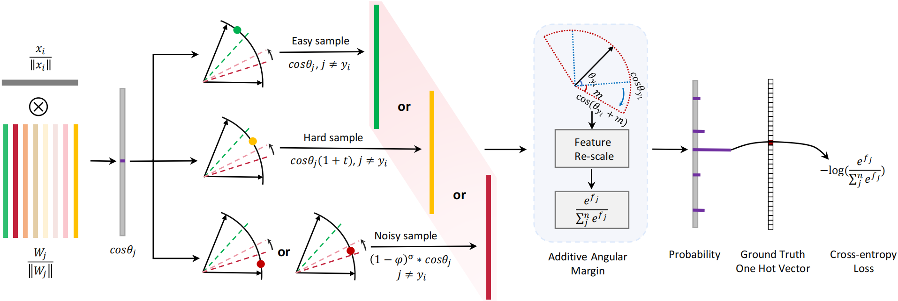

# MLA-ArcFace
Multi-level Attended ArcFace for Improved Deep Face Recognition

## Introduction
In this paper, we propose a multi-level attended MLA-ArcFace, including self-attention, channel attention, and spatial attention, to achieve a number of advantages, including: (i) the added Self-attention alleviates its local restriction to sustain a global correlation in extracting discriminating facial features, enabling its implementation to achieve global exploitation across the entire image rather than local regions; (ii) the added Channel attention dynamically adjusts the importance of those individually featured channels, emphasizing a tighter relevance to strengthen its roles in face recognition; (iii) the added Spatial attention refines spatial feature maps, enabling the model to focus more on those spatially critical regions of the face. As such added attentions enable the existing ArcFace to focus its extensive learning upon those attended regions, our proposed achieves the overall advantage that its learning intensiveness is enhanced, leading to significant efficiency improvement without compromise upon its performances in face recognition. To optimize the balance between the existing strength of ArcFace and the added multi-level attentions, we further introduce a learnable constraining parameter to coordinate the influence of such attended learning. Comparative experiments validate both the efficiency and the effectiveness of our proposed, which can be highlighted as: (i) For efficiency, our proposed achieves 47\% faster convergence than ArcFace over LFW, and over other datasets, including CFP-FP, AGEDB-30, CALFW, and CPLFW, the improved convergence ranges from 11\% to 23\% in comparison with the existing ArcFace; (ii) For effectiveness, our proposed outperforms ArcFace over all test sets when trained on Glint360K and MS1MV3, over four out of five when trained on MS1MV2.
 


## Requirements
In order to enjoy the new features of pytorch, we have upgraded the pytorch to 1.9.0.  
Pytorch before 1.9.0 may not work in the future.  
- tensorboard
- easydict
- mxnet
- onnx
- sklearn

## Download Datasets or Prepare Datasets
[InsightFace](https://github.com/deepinsight/insightface/tree/master/recognition/_datasets_) provides a range of preprocessed labeled face datasets, including the MS1MV2, VGG2 etc. dataset used in RobustFace.

**For Training Datasets:**
- MS1MV2 (87k IDs, 5.8M images)
- [MS-Celeb-1M ](https://www.microsoft.com/en-us/research/project/ms-celeb-1m-challenge-recognizing-one-million-celebrities-real-world/) (100k IDs, 10M images)
- Glint360K (360K IDs, 18M images)

**For Validation Datasets:** 
- LFW (5749 IDs, 13,233 images, 6k Pairs)
- AgeDB-30 (570 IDs, 12,240 images, 7k Pairs)
- CFP-FP (500 IDs, 7k images, 7k Pairs)
- CALFW (5749 IDs, 13,233 images, 6k Pairs)
- CPLFW 5749 IDs, 13,233 images, 6k Pairs)

**For Testing Datasets:** 
- IJB (IJB-B, IJB-C)

## How to training
To train a model, run `train.py` with the path to the configs.
The example commands below show how to run distributed training.

```shell
python -m torch.distributed.launch --nproc_per_node=1 --nnodes=1 --node_rank=0 --master_addr="127.0.0.1" --master_port=12581 train.py configs/ms_celeb_1m_r100.py
```
If you want to train on a machine with multiple GPUs, you can achieve this by `--nproc_per_node`. For example, on a machine with 8 GPUs:
```shell
python -m torch.distributed.launch --nproc_per_node=8 --nnodes=1 --node_rank=0 --master_addr="127.0.0.1" --master_port=12581 train.py configs/ms_celeb_1m_r100.py
```

## Experimental results
The full experimental results will be presented after publication of the paper.
